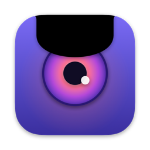
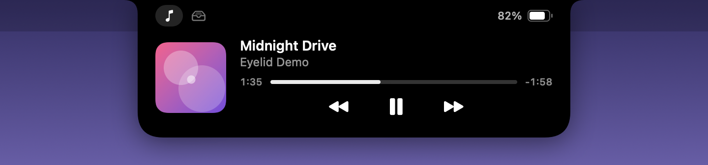
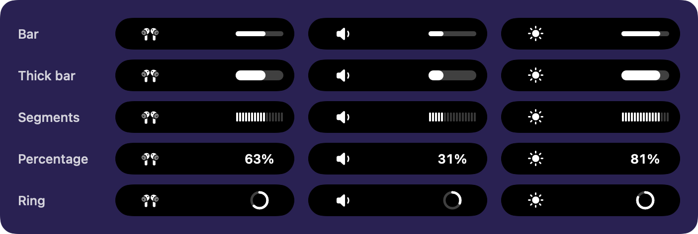
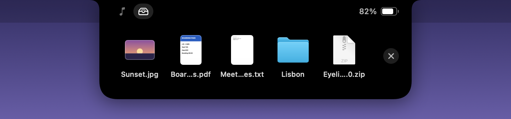
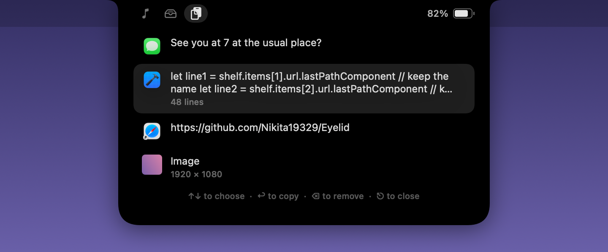
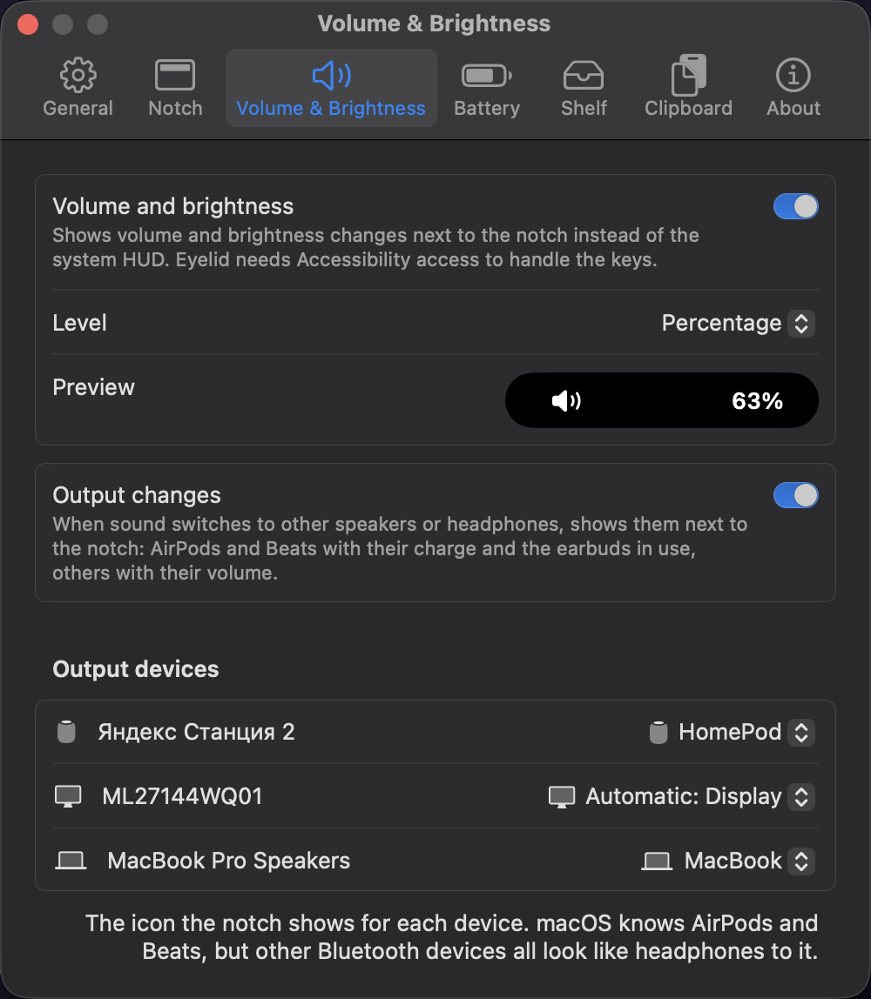

<div align="center">



# Eyelid

**An open-source, Dynamic Island–style notch for your MacBook.**

[](https://github.com/Satis-ku/Eyelid/actions/workflows/build.yml)
[](https://github.com/Satis-ku/Eyelid/releases/latest)
[](#install)
[](LICENSE)



</div>

Eyelid lives in the notch and blends in with it. Hover over the notch and it opens to show what's playing. Drop files on it to keep them at hand, or press a shortcut for what you copied lately. Press a volume or brightness key and the level appears beside the notch instead of the system HUD. Plug in the charger and the battery shows up for a moment.

> **Status:** early, but usable day to day. Expect rough edges.

**Contents:** [Features](#features) · [Install](#install) · [Privacy](#privacy) · [Build from source](#build-from-source) · [How it works](#how-it-works) · [Security](#security) · [Support](#support) · [Contributing](#contributing) · [Roadmap](#roadmap) · [License](#license)

## Features

### The notch

- **Blends in.** The closed notch matches the hardware cutout, so you don't notice Eyelid until you need it.
- **Hover to open.** The notch opens when the pointer reaches it and closes when the pointer leaves. You can add a delay, and Force Touch trackpads give a haptic tick.
- **Tabs** in the open notch: Now Playing, the file shelf, and the clipboard history once you turn it on.
- **Stays out of the way.** No Dock icon, on every Space and over full-screen apps. Clicks pass through to the menu bar while the notch is closed.
- **Macs without a notch** get a virtual one at the top of the main display.
- **Several displays.** By default the notch follows the pointer from display to display. It can also stay on one display, or show on every display, each with its own hover. The volume HUD, battery and output changes, and the clipboard history show up on the display with the pointer.

### Now Playing

- **Any app.** Apple Music, Spotify, Yandex Music, YouTube in a browser: anything that reports to the macOS Now Playing widget.
- **In the open notch:** artwork, title, artist, progress and playback controls.
- **Live activity:** while something plays, the closed notch shows the artwork on one side and an equalizer on the other.
- **Track title:** when something starts playing, the closed notch drops a little, like a lower eyelid, to show the title in the colors of the artwork. Titles too long to fit scroll by.


### Volume and brightness

- **Replaces the system HUD.** The volume, mute and brightness keys show an icon on the left of the notch and the level on the right, whether the notch is closed or open.
- **Knows the output device.** AirPods of every model, Beats, headphones, the MacBook speakers, displays, AirPlay. You can pick the icon for each device.
- **Five level styles:** bar, thick bar, segments, percentage and ring.
- **Fine steps.** Option-Shift changes the level in quarter steps, as in macOS.
- **Off by default,** since handling the keys needs Accessibility access. See [Volume and brightness HUD](#volume-and-brightness-hud).

- **Output changes.** When sound switches to other speakers or headphones, the notch shows them for a moment. AirPods and Beats come with their charge in a ring, as on iPhone. With one earbud in, it shows on its own side of the notch and its charge on the other, and putting the second one in or taking one out shows the change. Other outputs show their volume.
- **The earbuds in use** show in the volume HUD too: one AirPod, or the pair.



### Battery

- **Charging and unplugging.** Plugging in or unplugging the charger shows the charge beside the notch for a few seconds, green while charging.
- **Low battery warnings** at 20% and 10%.
- **Battery level** in the open notch.

### File shelf

- **Drop files on the notch.** Drag files toward the notch and it opens to the shelf. Drop them anywhere on it.
- **Drag them out** to Finder, Mail, a chat or any other app. A file then leaves the shelf, unless you turn that off.
- **Files stay where they are.** The shelf only keeps a reference. It follows a file you rename or move, and survives a relaunch.
- **Works with Photos, Mail and Safari,** whose photos, attachments and images only become files once they're dropped. Eyelid saves them in its Application Support folder until they leave the shelf.
- **All at once.** With several files, the first tile drags them all.
- **AirDrop** a file from its menu, or all of them with the button beside the files.
- **Double-click** opens a file. **Right-click** to show it in Finder or remove it.



### Clipboard history

- **A shortcut away.** ⇧⌘V opens what you copied lately in the notch, wherever the pointer is. You can record a different shortcut in Settings.
- **Compact.** Each copy takes one or two lines, however long it is, with its length below: "48 lines". The selected one shows a few more lines. Images show a thumbnail and their size, files their icon and names.
- **Keyboard first.** Type to search, ↑ and ↓ choose, Return copies, Escape closes. The app you were in gets the keyboard back, so ⌘V pastes right away, or turn on **Paste right away** to skip it. Clicking a copy works too.
- **Preview.** Space shows the selected copy in full: all of a long text, scrollable, or an image as large as it fits.
- **Pins.** ⌘P pins a copy to the top, where new copies don't push it out, and keeps it when Eyelid quits. ⌘⌫ removes a copy.
- **Private.** Off by default. The last 50 copies stay in memory only, and copies that password managers mark as concealed are left out. See [Privacy](#privacy).



### Settings

The eye icon in the menu bar opens Settings and quits Eyelid.

| Tab | What's there |
|---|---|
| General | Launch at login, the displays that show a notch |
| Notch | Hover delay, haptic feedback, live activity, track title |
| Volume & Brightness | The HUD, its level style, output changes, and an icon for each output device |
| Battery | Battery activity |
| Shelf | The file shelf, whether dragged-out files leave it, and a button to clear it |
| Clipboard | The clipboard history, its shortcut, pasting right away, and a button to clear it |



## Install

Eyelid runs on macOS 14 Sonoma or later, on Apple silicon and Intel Macs. It's made for MacBooks with a notch; other Macs get a virtual one.

### With Homebrew

```sh
brew install --cask satis-ku/tap/eyelid
```

The [tap](https://github.com/Satis-ku/homebrew-tap) only accepts zips that Eyelid's Release workflow built and attested, and picks up new releases within a day.

### By hand

1. Download `Eyelid-X.Y.Z.zip` from the [latest release](https://github.com/Satis-ku/Eyelid/releases/latest).
2. **Optional:** check that the zip was built from this repository by its Release workflow, with the [GitHub CLI](https://cli.github.com):

   ```sh
   gh attestation verify Eyelid-0.6.0.zip --repo Satis-ku/Eyelid
   ```

   Releases up to 0.5.0 were built before the repository moved from `Nikita19329`, so check those with `--repo Nikita19329/Eyelid`.

3. Unzip it and move `Eyelid.app` to Applications.

### First launch

Eyelid isn't notarized yet, so macOS blocks the first launch. Allow it in **System Settings → Privacy & Security** with **Open Anyway**, or remove the quarantine flag:

```sh
xattr -dr com.apple.quarantine /Applications/Eyelid.app
```

### Volume and brightness HUD

1. Open **Settings → Volume & Brightness** and turn on **Volume and brightness**.
2. macOS asks for Accessibility access. Allow Eyelid in **System Settings → Privacy & Security → Accessibility**. Eyelid picks the change up within a few seconds, no restart needed.

Releases are signed ad hoc, so macOS ties the permission to one exact build. After updating Eyelid, remove it from the Accessibility list and allow it again. Eyelid shows the prompt on launch.

### Updating and uninstalling

- **Update:** `brew upgrade --cask eyelid`. By hand: quit Eyelid from the menu bar, replace `Eyelid.app` with the new one, and open it.
- **Uninstall:** turn off **Launch at login** in Settings first. Then run `brew uninstall --cask --zap eyelid`, which also removes Eyelid's settings and the files it saved for the shelf. By hand: quit Eyelid, delete `Eyelid.app`, run `defaults delete io.github.satis-ku.eyelid`, and delete `~/Library/Application Support/io.github.satis-ku.eyelid`. Remove Eyelid from the Accessibility list if you allowed it there.

## Privacy

- **Nothing leaves your Mac.** Eyelid never connects to the internet and has no analytics or telemetry.
- **What it reads stays local.** What's playing, the battery and the audio devices are read on your Mac and never logged.
- **Accessibility only if you ask for it.** Eyelid requests it only when you turn on the volume and brightness HUD, and then handles only the volume, mute and brightness keys. Other keys aren't touched.
- **The shelf doesn't read your files.** It keeps bookmarks to them in user defaults. Previews come from Quick Look, which runs in its own sandboxed process.
- **The clipboard history is opt-in and stays in memory.** It's gone when Eyelid quits, except for copies you pin, which are saved in Eyelid's Application Support folder. Copies that password managers mark as concealed or transient aren't kept. Since macOS 15.4, macOS also asks before an app reads what other apps copy: allow Eyelid under **Privacy & Security → Paste from Other Apps**, then reopen it.
- **Settings** are stored in macOS user defaults.

## Build from source

You need macOS 14 or later, Xcode, and CMake (`brew install cmake`). The Command Line Tools alone are not enough: on the macOS 27 SDK, SwiftUI's `@State` is a macro whose compiler plugin ships only with Xcode.

```sh
git clone --recurse-submodules https://github.com/Satis-ku/Eyelid.git
cd Eyelid
make run
```

| Command      | What it does                                                          |
|--------------|-----------------------------------------------------------------------|
| `make run`   | Builds `build/Eyelid.app`, quits a running copy, and opens the new one |
| `make app`   | Release build of `build/Eyelid.app`                                   |
| `make debug` | Debug build of `build/Eyelid.app`                                     |
| `make test`  | Runs the unit tests                                                   |
| `make icon`  | Renders the app icon from `scripts/render-icon.swift` and packs it     |
| `make clean` | Removes `.build` and `build`                                          |

- **Quick iterations:** after `make app` has run once, `swift run` from the repository root works too. To work in Xcode, open `Package.swift`.
- **Versions come from git:** builds show the latest `vX.Y.Z` tag, and the commit count as the build number.
- **Universal builds:** `UNIVERSAL=1 make app` builds for both Apple silicon and Intel.
- **Signing:** `make` signs with the first Apple Development certificate in your keychain, so macOS keeps the Accessibility permission across rebuilds. Without a certificate it signs ad hoc, and the permission has to be granted again after every rebuild. To get a free certificate, sign in with an Apple ID in **Xcode → Settings → Accounts**, then choose **Manage Certificates… → + → Apple Development**. `CODESIGN_IDENTITY=-` forces ad hoc, and `CODESIGN_IDENTITY="…"` picks another identity. The certificate carries your Apple ID email, so share only release builds, which CI signs ad hoc.

## How it works

**The notch window.** A borderless, non-activating `NSPanel` floats just above the menu bar on every Space. Its size comes from `NSScreen.safeAreaInsets` and the `auxiliaryTopLeftArea` and `auxiliaryTopRightArea` next to the notch. The panel ignores mouse events while closed, so the menu bar under it stays clickable. A global mouse monitor opens it when the pointer enters the notch. Mouse events, unlike key events, don't need the Accessibility permission. Each display that shows a notch gets its own panel, and the panels are added, moved and removed as displays come and go.

**Now Playing.** Since macOS 15.4, MediaRemote, the private framework behind the Now Playing widget, only answers Apple's own entitled processes. Eyelid uses [mediaremote-adapter](https://github.com/ungive/mediaremote-adapter): it loads a small framework into Apple's signed `/usr/bin/perl`, which is still allowed to query MediaRemote, and streams updates as JSON lines. Eyelid runs it as a child process and decodes its output.

**Volume and brightness.** An event tap intercepts the volume, mute and brightness keys. Eyelid changes the level itself, so macOS never sees the press and never shows its HUD. Volume goes through CoreAudio. macOS has no public API for display brightness, so Eyelid calls the private DisplayServices framework, as MonitorControl and similar utilities do. Keys Eyelid can't handle, such as on an output without volume control, go to macOS as usual.

**Device icons.** The volume HUD picks the icon from what CoreAudio reports about the output: the connection type, whether wired headphones are plugged in, and for Bluetooth the model UID, which holds the vendor and product ID. That's enough for AirPods and Beats, even after renaming them. Other Bluetooth devices all look like headphones to macOS, hence the per-device icon setting.

**Battery.** IOKit's power source notifications report every change, and Eyelid turns them into plug, unplug and low battery events.

**Output changes.** A CoreAudio listener notices the default output switching. macOS keeps the charge of AirPods and Beats, earbud by earbud and the case, as IOKit power sources for its Batteries widget. The public IOKit call only lists the Mac's own battery, so Eyelid looks up the private one that lists accessories, which needs no Bluetooth permission. An earbud in the case runs on the case's power, which tells which one is in use, and IOKit posts a notification when that changes.

**Clipboard history.** macOS has no notification for copies, so Eyelid checks the pasteboard's change count twice a second and reads the pasteboard only after it changes. It keeps plain text, rich text, HTML, links, files and images, and puts them all back when you choose a copy. The shortcut is a Carbon hot key, which needs no permission. While the history is open, the notch's panel takes the keyboard without activating Eyelid, the way Spotlight does, so the app in front stays in front and gets the keyboard back when the history closes. **Paste right away** then presses ⌘V for you, which needs Accessibility access.

**File shelf.** A drag starts by filling the system's drag pasteboard, so the mouse monitor tells a file drag from other mouse moves by its change count and types, and opens the notch to the shelf. The panel's content view is registered for file URLs and file promises. Files are kept as bookmarks, which find them again after a rename, a move or a relaunch. Promised files are received into a folder of their own per drop, and folders no longer on the shelf are deleted at the next launch: the app a file was just dragged to may still be reading it. Dragging out offers the same operations as Finder, so Finder moves a file within a disk and copies it to another disk or with Option.

## Security

With the volume and brightness HUD on, Eyelid holds Accessibility access: it can watch input and control other apps. So the main risk is another program on the Mac getting its code to run with that access. Eyelid guards against this:

- **No code loading into Eyelid.** Builds are signed with the hardened runtime. The app binary also has a `__RESTRICT` segment, so dyld ignores `DYLD_*` variables, which the hardened runtime alone doesn't ensure for ad hoc signed builds. The Release workflow fails if either protection is missing.
- **A clean environment for perl.** macOS treats Eyelid as responsible for its child processes, and perl runs code named in variables such as `PERL5OPT`. So the adapter starts with nothing but `PATH`.
- **Code only from the bundle.** Release builds load the adapter only from the app bundle. Looking in the working directory, for `swift run`, is limited to debug builds.
- **Careful with artwork.** Any app or web page can set now playing artwork. Eyelid drops images over about 8 MB or 50 megapixels, decodes the rest away from the main thread, and scales them down to what the notch shows.
- **Supply chain.** mediaremote-adapter is pinned to a reviewed release. Workflows pin GitHub Actions to commit SHAs, which Dependabot keeps current. Release zips come with a build provenance attestation.

## Support

Eyelid is free and open source, and made in spare time. If it's useful to you, you can support my work on [Boosty](https://boosty.to/satis.ku).

## Contributing

Issues and pull requests are welcome. For anything bigger than a small fix, please open an issue first so we can agree on the approach.

- **Branches:** `main` is the latest release, and `develop` collects work for the next one. It's the default branch, so branch off it, for example `feat/calendar`, and open your pull request against it.
- **Commits** follow [Conventional Commits](https://www.conventionalcommits.org): `feat:`, `fix:`, `docs:`, `ci:` and so on.
- **CI** builds and tests every pull request and every push to `main` and `develop` on macOS 26. The built app is attached to each run as a zip for 14 days, so you can try a change without building it yourself.
- **Tests** cover what can be checked without a screen: decoding the adapter's output, playback time, battery events, media keys and level steps, device icons, notch layout and hover areas, settings, and artwork limits. Behavior on screen, such as hovering, haptics and the look of the notch, still needs a try on a real Mac. Mention what you checked in your pull request.

<details>
<summary><b>Releasing</b> (maintainers)</summary>

1. Open a pull request to `main` titled `Release X.Y.Z`, from `develop` or from a `release/X.Y.Z` branch off `develop` for last changes such as the release notes. Merge it with a merge commit once the checks pass.
2. Tag the merge commit on `main`:

   ```sh
   git switch main && git pull
   git tag -a v0.2.0 -m "Eyelid 0.2.0"
   git push origin v0.2.0
   ```

3. Bring the release back into `develop`, so development builds pick up the new version:

   ```sh
   git switch develop && git pull
   git merge main
   git push
   ```

4. The [Homebrew tap](https://github.com/Satis-ku/homebrew-tap) picks up the release within a day. To update it right away:

   ```sh
   gh workflow run update.yml --repo Satis-ku/homebrew-tap
   ```

The Release workflow runs the tests and builds a universal app stamped with the tag's version. It checks the version, the architectures, the minimum macOS version, the signature and the protections listed under [Security](#security). This build job can only read the repository. A separate publish job, the only one that can write, signs a build provenance attestation for the zip, then publishes a GitHub release with the zip, its SHA-256 checksum, and notes generated from the merged pull requests. Tags with a suffix, such as `v0.2.0-beta.1`, become prereleases.

</details>

<details>
<summary><b>Project layout</b></summary>

```
Sources/Eyelid/
  App/          App entry point, menu bar item, app delegate
  Notch/        Notch geometry, panel, shape, hover handling, root view
  NowPlaying/   mediaremote-adapter client, now playing model, artwork, views
  Battery/      IOKit battery reading, battery events and views
  HUD/          Media key tap, volume (CoreAudio), brightness (DisplayServices), device icons, HUD view
  Output/       Output switches, headphone charge and earbuds in use (IOKit accessory power sources), views
  Shelf/        File shelf: bookmarks, drops and file promises, dragging out, views
  Clipboard/    Clipboard history, keyboard shortcuts (Carbon hot keys), pasting, views
  Settings/     Preferences, Settings window, launch at login
Tests/          Unit tests (Swift Testing) for the logic that needs no screen
Resources/      Info.plist, AppIcon.icns
scripts/        build-app.sh builds, stamps and signs Eyelid.app; render-icon.swift draws the icon
Vendor/         mediaremote-adapter (git submodule)
docs/images/    Images for this README, rendered from Eyelid's own views
```

</details>

## Roadmap

- [ ] Calendar: upcoming events
- [ ] Automatic updates (Sparkle) and notarization

What's already in each version is in the [release notes](https://github.com/Satis-ku/Eyelid/releases).

## Acknowledgements

- [mediaremote-adapter](https://github.com/ungive/mediaremote-adapter) by Jonas van den Berg and contributors makes Now Playing possible on current macOS. It's licensed under the BSD 3-Clause License, and its license text is in the app bundle under `Contents/Resources/Licenses`.
- Eyelid is inspired by Dynamic Island and by notch apps such as Alcove and boring.notch. It is an independent project and is not affiliated with Apple or with any of those apps.

## License

Eyelid is licensed under the [GNU General Public License v3.0](LICENSE).
